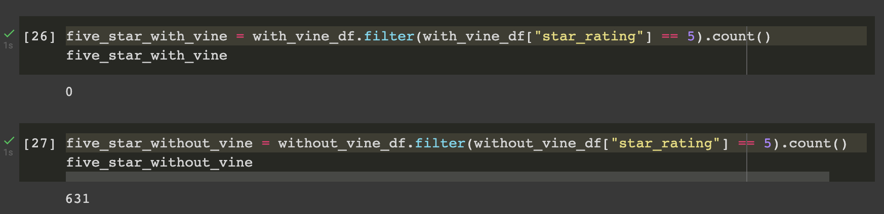
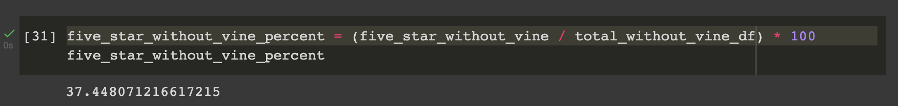

# Amazon_Vine_Analysis

## Overview of Analysis

For this project we needed to analyze Amazon reviews that were written by members of the paid Amazon Vine program. I picked a dataset and used PySpark to perform the ETL process, and I loaded the transformed data into pgAdmin. I then used PySpark to deterine if there was any bias toward favorable reviews from Vine members compared to non-vine members.

### Purpose

The purpose of this analysis is to determine if there is bias toward positive reviews from Vine members in this dataset.

## Results

This dataset ended up having zero reviews from Vine members, and 1,685 reviews from non-vine members.

The number of reviews that were five star reviews from non-vine members was 631, and 0 from vine members.

To find the percentage of five star reviews out of all the non-vine reviews I divided the five star reviews from the total reviews. 631/1685 turned out to be 37.4% of the reviews.

## Summary

Since this dataset had no Vine member reviews, I am unable to state if there is any positivity bias for reviews in the Vine program. There was no data for vine members. In order to determine if Vine members are more likely to be positively bias we need to run tests over other (multiple) Amazon review datasets.