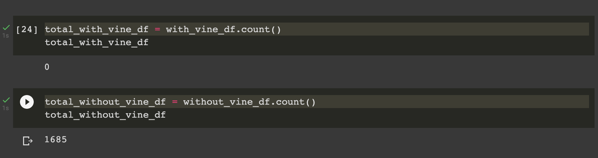

# Amazon_Vine_Analysis

## Overview of Analysis

For this project we needed to analyze Amazon reviews that were written by members of the paid Amazon Vine program. I picked a dataset and used PySpark to perform the ETL process, and I loaded the transformed data into pgAdmin. I then used PySpark to deterine if there was any bias toward favorable reviews from Vine members compared to non-vine members.

### Purpose

The purpose of this analysis is to determine if there is bias toward positive reviews from Vine members in this dataset.

## Results

This dataset ended up having zero reviews from Vine members, and 1,685 reviews from non-vine members.

